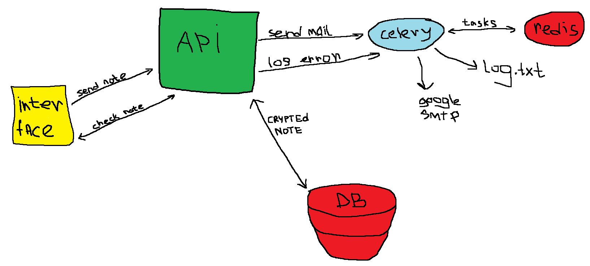

# Anonym notes
Application for anonymously sending notes to specified email addresses

## Backend scheme 

## CORE Required libraries:
- FastAPI
- Uvicorn
- Alembic
- Psycopg2
- Jinja2
- Redis
- Celery/Flower
- Sqlalchemy
- Pydantic
- Cryptography
